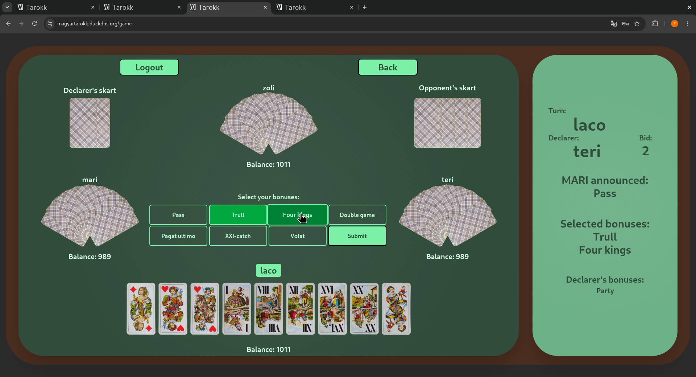
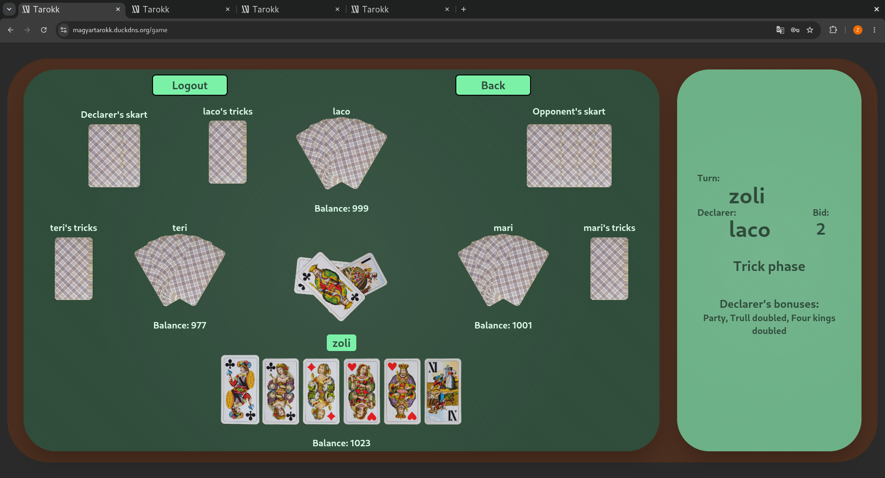

# Hungarian Tarokk 🎴

> A real-time, four-player online Hungarian Tarokk card game.

<p align="center">
  <a href="https://magyartarokk.duckdns.org">
    
  </a>
</p>

<p align="center">
  
  
  
  
  <br>
  
  
  
  
  
</p>

## 🎮 Play now

The game is live at **[magyartarokk.duckdns.org](https://magyartarokk.duckdns.org)**.

> **Registration is required**, and a full game needs **4 players** sitting at the same
> table — grab three friends and join the same room.

## About

**Hungarian Tarokk** is a classic trick-taking card game played by four people with a
**42-card Tarokk deck**. This project brings it online: players register, join a shared
table, and play through the bidding, bonus-announcement and trick phases together in
real time. Game state is synchronized across all four browsers over WebSockets, so every
deal, bid, announcement and played card appears instantly for everyone.

New to the rules? See the full ruleset on
**[pagat.com → Hungarian Tarokk (XX-hívás)](https://www.pagat.com/tarot/xx-hivas.html)**.

## Screenshots

| Bonus announcement phase | Trick-play phase |
|:---:|:---:|
|  |  |

## Tech stack

| Layer | Technologies |
|---|---|
| **Frontend** | React 19, TypeScript 5.9, Tailwind CSS 4, Vite 7, React Router 7, STOMP.js + SockJS (WebSocket client) |
| **Backend** | Java 21, Spring Boot 4, Spring Security + JWT (JJWT), Spring WebSocket (STOMP), Spring Data JPA, Lombok |
| **Infrastructure** | PostgreSQL 17, Docker & Docker Compose, Caddy (automatic HTTPS reverse proxy), Hetzner VPS |

## Architecture

A React single-page app talks to a Spring Boot backend behind a Caddy reverse proxy
that terminates HTTPS. **Authentication** goes over a REST API (JWT, stateless), while
**all real-time gameplay** — dealing, bidding, bonus announcements and the trick phase —
flows over a STOMP/SockJS WebSocket connection.

```
                         ┌──────────────────────── Caddy (HTTPS) ────────────────────────┐
  Browser                │                                                                │
  ┌──────────────┐       │   REST   /api/auth/*  ──►  ┌──────────────┐                    │
  │ React SPA    │ ◄─────┼───────────────────────────│ Spring Boot  │ ◄──► PostgreSQL 16  │
  │ (STOMP+REST) │       │   WS     /ws  (STOMP)  ──► │  (JWT + WS)  │                    │
  └──────────────┘       │                            └──────────────┘                    │
                         └────────────────────────────────────────────────────────────────┘
```

## Local development

Clone the repo:

```bash
git clone https://github.com/bencsicszoli/Hungarian-tarokk.git
cd Hungarian-tarokk
```

### Option A — Docker (everything at once)

```bash
cp .env.example .env          # set POSTGRES_PASSWORD and JWT_SECRET
docker compose up --build
```

- Frontend → http://localhost:3000
- Backend  → http://localhost:8080
- PostgreSQL → localhost:5433

### Option B — Run services manually

**Backend** (Java 21, needs a running PostgreSQL and a `JWT_SECRET`):

```bash
cd backend
mvn spring-boot:run
```

**Frontend** (Vite dev server with hot reload on port 5173; `/api` and `/ws` are proxied
to the backend on :8080):

```bash
cd frontend
npm install
npm run dev
```

## Deployment

The game runs on a Hetzner VPS with Docker and a Caddy reverse proxy handling free,
automatic HTTPS. A complete, copy-paste production setup guide is in **[`DEPLOY.md`](DEPLOY.md)**.

## Project layout

```
backend/     Spring Boot API + WebSocket game engine (Java 21)
frontend/    React + Vite single-page app (TypeScript)
docker-compose.yml        local dev stack
docker-compose.prod.yml   production stack (with Caddy)
Caddyfile                 reverse proxy + HTTPS config
DEPLOY.md                 production deployment guide
```
